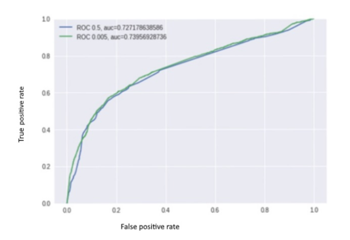
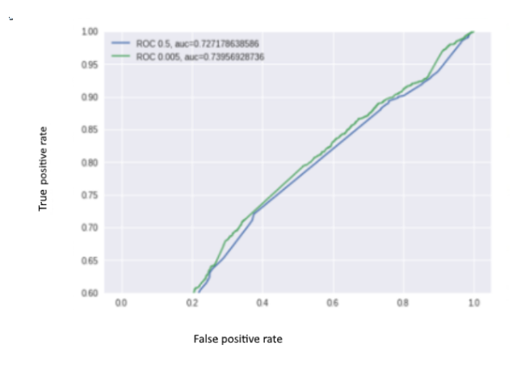

Gradient Boosting Method for credit risk analysis

Through this project my aim was to explore the most up-to-date scoring systems and the  mysteries of model building. The artificial intelligence models show the direction of development, definitely I see this the absolute direction of scoring development as well. Credit rating analysis plays a key role in classifying. During my research, "Deep Learning" methods proved to be the most effective algorithms in this topic, and based on the literature, the Esemble methods had a stronger prediction ability than their counterparts. Gradient Boosting is also an Esemble method, it has proven to be an excellent algorithm for diplomacy analysis due to its parametrizability, development, proliferation and modernity.

Firstly I learned that it does not matter how effective model we built, if we are using incorrect or too little data, we will not be able to build a succesfull model. The foundation of creating a good scoring model are handling, collecting data and using advanced data mining tools. 

Dealing with parameter tuning prone to be a good method, with this method I was able to build a succesfull model. The independence of the parameters to be set - in general - did not seemed to be verifiable in my research. Therefore, it is necessary to systematically apply "backstepping" for each test procedure, which is likely to be inversely proportional to the analytical routine.

The applied python environment proved to be useful, with it’s many features. Some minor deficiencies: using cost matrix optimization, or categorical variables are not directly supported by Scikit-Learn.
 

Dataset
 
The data set originally had a high sample size (30,000) and it was also important for me to have the database to be binary problems
 
The process of solving the problem is outlined below. The process here is somewhat more general than the one I did (the latter being marked in white). This is partly due to the fact that the data is complete (no missing values) and also that it contains categorical values. The Scikit learn library, which is used as the core component of the process, is not able to handle categorical data directly, but supports its conversion into numeric ones.

The tuning of the parameters was done by using the GridSearchCV Scikit-learn function.  The random_state = 10 for the sake of reproducibility (it can be any number, 10 was a personal decision).
 
I started out from the "shrinking" parameter classifiable as "typical domain": learning_rate = 0.1. To this I searched for the optimum number of weak learners, I got {'n_estimators': 40} - with 0.782280755933 certainty. By keeping these two parameters, I have searched for the other parameters, based on the instructions of the document “Complete Guide to Parameter Tuning in Gradient Boosting (GBM) in Python” (Jain A., 2016).

Firstly I searched the optimal parameters of the trees: Based on the results of the search, I started with fixing the maximum depth of the trees at max_depth = 5, by modifying the size of the minimally cutable set. Then I searched for the size of the minimally cutable set and the minimum set for one letter: 'min_samples_split'= 430, 'min_samples_leaf'= 16 with 0.782614790876 accuracy.

  

Recording these as well, I found the optimum maximum number of attributes that can be selected at one time at max_features = 4: {'max_features': 4} - unchanged - with 0.782614790876 accuracy.
 
The other parameter associated with the algorithm's random selection determines the sampling rate of the samples at the bottom. I did not get bigger accuracy even examining it with 0.01 interval. {'subsample': 0.8} - 0.782614790876
 
Then the fixing of these parameters, was followed by the most resource consuming optimization phase.  By reducing the value of the abbreviation parameter, the optimum number of trees increases. Then I determined the optimal number of poor learners for the 0.05, 0.01, 0.005 values with the following results:
˗ learning_rate = 0.05: n_estimators = 150, accuracy: 0.782837586989
˗ learning_rate = 0.01: n_estimators = 774
˗ learning_rate = 0.005: n_estimators = 1900.

 
Processing

Choosing a threshold that corresponds to the calculations of return
 
The model can assign ratings to the samples. Based on this, we can decide how to classify the samples. For credit scoring, there are two classes, so a threshold value is required. One is the class of "non-paying debtors", if we do not classify someone to this class, but becomes one, it can cause considerably more loss than the "opposite" when we do not give a loan to someone, but it would be a “paying debtor”. Therefore, we must distinguish these two classes.
 
Confucius values ​​- ROC curve

We should put the sample elements in order based on the model evaluation. For a larger serial number, you may not have a smaller rating number. Then, for each threshold (or serial number), we assigning two so called confusion value, which can be estimated on the basis of the test pattern: 
IPA (True Positive Rate): If we select this value (or serial number) as a threshold (or threshold serial number), we would classify the truly failing debtors into the "non-paying debtors" class.
HPA (False Positive Rate): If this value (or serial number) is chosen as a threshold (or threshold number), we would classify the paying debtors into the "non-paying debtors" class.

HPA is on the horizontal axis and the IPA on the vertical axis and we give this point in the coordinate system - acctually or imaginary - marked with the given value or serial number. The defined points form the ROC curve.

Using a given, more generally interpretable cost calculator, we decide which IPA threshold is the right one for us (assuming that IPA is the dominant cost factor. If this is not clear, both confusion values ​​can be considered). Then, with a quick search method we will look for the (only imaginary written on the graph) rating threshold.
 
The ROC curves obtained during the analysis:
The diagram below shows the effectiveness of our model with the help of the ROC curve as well as the figure illustrates that the model performs better with tuned teaching.
 
On the figure below I highlighted the section which belongs to a higher confusion value and more interesting:

When analyzing generated data, I managed to produce a much more efficient model:

Performance/ recources
 
Since the number of trees is interesting for the resources needed, I have shown the area below the ROC curve, depending on the number of trees, 0.05, 0.01, 0.005, up to 1900 trees.
The AUC is shown on the two figure below depending on the number of trees.

![alt text]AUC.PNG
The other figure shows the areas under the ROC curve on 0.5, 0.1, 0.05 values to 150 trees. 
![alt text]AUC2.0.PNG
In the above figures we can observe the importance of tuning the parameters, the red color indicates the student pattern, the blue indicates the test pattern, while the dashed is for the tuned teaching and the continuous curve represents the tune-free teaching. The tuned curve performs better than the one without tuning, and if you increase the abbreviation, you can achieve even better results.

The above diagram illustrates the most important two variables for separating the data set, the model shows that these two variables contain the most information about the target variable.  
![alt text]variables.PNG

Contribute

Feel free to contribute via pull request.

Credits

Amatriain, X. (2015): What are the advantages of different classification algorithms.	 https://www.quora.com/What-are-the-advantages-of-different-classification-algorithms 2017.02.12.

Blake, J.(2016): Big data overhauling credit scores. http://dataconomy.com/2016/03/big-data-overhauling-credit-scores-2/  2016.12.10.

Breiman, L. (2001), Random Forests. In Machine Learning 45 (1), 5-32.Breiman, Leo: Random 

Hastie T. (2014): Boosting http://web.stanford.edu/~hastie/TALKS/boost.pdf 2017.03.20.
(https://www.youtube.com/watch?v=wPqtzj5VZus 2017.03.20.)

Jain A. (2016): Complete Guide to Parameter Tuning in Gradient Boosting (GBM) in Python
https://www.analyticsvidhya.com/blog/2016/02/complete-guide-parameter-tuning-gradient-boosting-gbm-python/ 2017.04.02.

Mayr, A., Binder, H., Gefeller, O., Schmid, M. (2014): The Evolution of Boosting Algorithms. 2-9.
https://arxiv.org/pdf/1403.1452.pdf 2017.03.10.

Saberi, A. (2014): Machine learning W6 5 Regularization and Bias Variance	 https://www.youtube.com/watch?v=yq-9A5P-cXw  2017.04.25.

Szabó A. (2010): Random Forests- Véletlen Erdők     	                   https://dms.sztaki.hu/sites/dms.sztaki.hu/files/file/2011/randomforests.pdf  2017.03.20.

License

A short snippet describing the license (MIT, Apache etc)
MIT © Klariss
