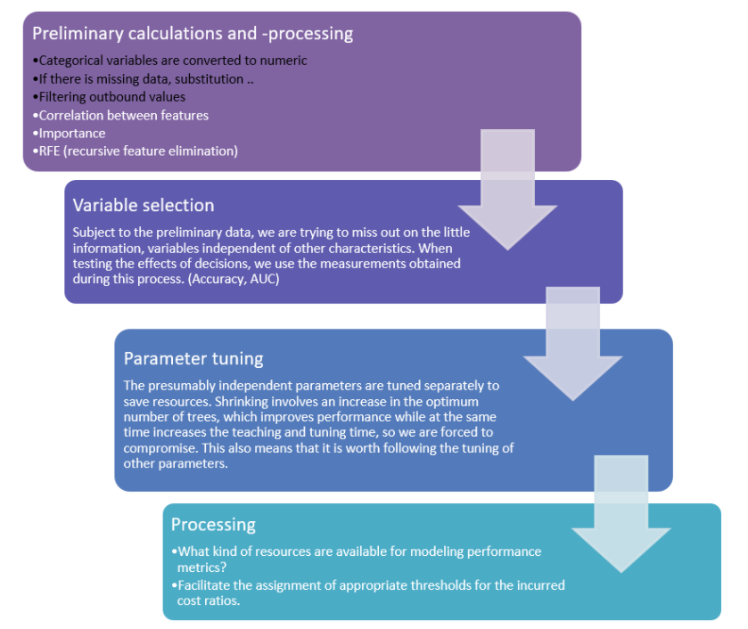

Gradient Boosting Method for credit risk analysis

Through this project my aim was to explore the most up-to-date scoring systems and the  mysteries of model building. The artificial intelligence models show the direction of development, definitely I see this the absolute direction of scoring development as well. Credit rating analysis plays a key role in classifying. During my research, "Deep Learning" methods proved to be the most effective algorithms in this topic, and based on the literature, the Esemble methods had a stronger prediction ability than their counterparts. Gradient Boosting is also an Esemble method, it has proven to be an excellent algorithm for diplomacy analysis due to its parametrizability, development, proliferation and modernity.

Firstly I learned that it does not matter how effective model we built, if we are using incorrect or too little data, we will not be able to build a succesfull model. The foundation of creating a good scoring model are handling, collecting data and using advanced data mining tools. 

Dealing with parameter tuning prone to be a good method, with this method I was able to build a succesfull model. The independence of the parameters to be set - in general - did not seemed to be verifiable in my research. Therefore, it is necessary to systematically apply "backstepping" for each test procedure, which is likely to be inversely proportional to the analytical routine.

The applied python environment proved to be useful, with it’s many features. Some minor deficiencies: using cost matrix optimization, or categorical variables are not directly supported by Scikit-Learn.
 

Dataset
 
The data set originally had a high sample size (30,000) and it was also important for me to have the database to be binary problems
 
The process of solving the problem is outlined below. The process here is somewhat more general than the one I did (the latter being marked in white). This is partly due to the fact that the data is complete (no missing values) and also that it contains categorical values. The Scikit learn library, which is used as the core component of the process, is not able to handle categorical data directly, but supports its conversion into numeric ones.

